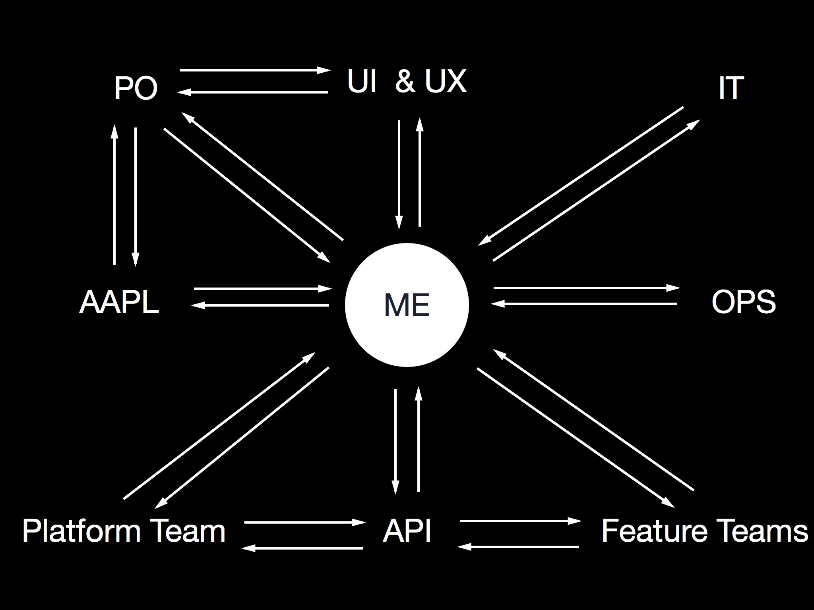

# [fit] DevOps in the iOS World

---

# [fit] Who am I?

---

# [fit] Piet, Indie from Hamburg

---

# [fit] I make Git2Go

---

# [fit] Wait, What?

^
* Indie talking about large team organization?
* Worked at XING before
* helped scaling a 4 person team to 16

---

# [fit] #DevOps

---

# [fit] History

* originated in 2008/2009
* months of release cycles to 10+ deploys a day
* bring together devs and ops
* ship faster

---

# Current iOS situation

* Months of release cycles
* Deploy from local Xcode
* low automation

---

# [fit] The 3 ways

^
* master one after another
* guidelines for achieving DevOps

---

# No. 1: Systems Thinking

^
* performance of entire system around you
* including dependencies (design, qa, app store, customer)

---

# No. 2: Amplifying Feedback

^
* shorten & amplify Feedback
* understanding and responding to all customers
* internal and external

---

# No. 3: Culture of Continual Experimentation and Learning

^
* take risks, learn from failures
* understand through repetition is prerequisite to mastery
* go deeper in danger than before
* get practice getting out of trouble too
-> improvement of daily work
-> creating rituals
-> introducing faults into the system

---

# [fit] #iOSDevOps

---

# No. 1: Systems Thinking

^
UX, UI, product, development, QA, app store, costumer
* all dependencies to your work
* new assets
* waiting for review

---

# No. 2: Amplifying Feedback

^
* Review of new designs
* Product & Costumer: integrated feedback, messaging, mail etc.
* Clear app store release notes to send costumer feedback
* QA & Dev: CI, Deployments, continuous testing

---

# No. 3: Culture of Continual Experimentation and Learning

^
* Try out new technologies once in a while
* tech talks
* 2 weeks releases to practice
* practice, practice, practice

---

# [fit] #PracticaliOSDevOps

^
* Let's talk practical stuff and examples

---

# No. 1: Systems Thinking

---

# The system
## Product Owner, UI Designer, UX Designer, Internal IT, Operations, iOS Feature Teams, iOS Platform Team, Apple

^
* try to understand relationships between them

---

^
* Try to replace humans with machines
* cut off IT & OPS and do it yourself
* integrate people into your team
* internal UI & UX instead of design team
* Understand how your app is developed
* who talks to whom

---

# No. 2: Amplifying Feedback

---

# Shorten Feedback loop between ...

---

# You and Your Tests
### Get instant feedback if you broke something
#### Travis CI, Cirlce CI, Jenkins, GitHub PullRequests, KIF, UIAutomation

---

# You and Apple
### Upload often, Release often, Automate everything possible
#### Fastlane Tools, Shenzhen, TestFlight

^
* Upload often
* Don't realize private API usage when uploading after 4 months
* Get warnings from iTunes Connect
* Release often, release MVPs get feedback
* Automate all the things

---

# You and your customer
### Get feedback of your app, give feedback to customer, keep response time under 2 hours
#### Supportkit, Slack, Mail

---

# You and your Designer
### Prototype, try new things, give them hints whats realistic
#### Invision, AppCooker

---

# No. 3: Culture of Continual Experimentation and Learning

---

## Automate all the tasks, Introduce release cycles, get used to upload once a week, streamline your QA process, remove humans from every process

^
Automate all the tasks
Introduce release cycles
get used to upload once a week
streamline your QA process
remove humans from every process
